# MoveClip

**운동 코칭 영상에서 숏츠 후보와 카드뉴스를 자동으로 뽑아내는 AI 파이프라인**

수업 촬영본에서 쓸 만한 구간을 찾느라 스크러빙하던 작업을 **완전 자동 처리**로 바꿨습니다.
사람의 역할이 *찾고 만들기*에서 **고르고 다듬기**로 바뀝니다 — 30분 촬영본 기준 **붙어 있어야 하는 시간 25~35분 → 3~5분**.

> AI 에이전트 교육 과제 — *내 도메인에서 AI로 개선 지점 찾아 PoC 만들기*
> 도메인: 크로스핏·하이록스·기능성운동·골프피트니스·통증케어 현장 지도 + 인스타그램 콘텐츠 발행

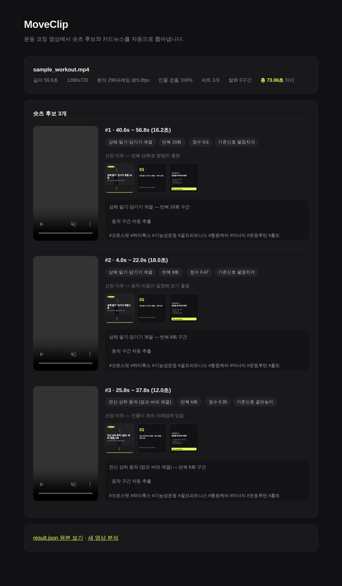

---

## 무엇을 하나

```
영상 ──┬─▶ YOLO11n-pose ──▶ 관절 17점 ──▶ 자기상관·피크검출 ──▶ 세트·반복 검출
       │                                          │
       └─▶ Silero VAD ──▶ Whisper ──▶ 자막·코칭큐 ─┴─▶ 하이라이트 점수 ──┬─▶ 9:16 숏츠 (자동 크롭 + 자막)
                                                                      └─▶ 카드뉴스 PNG + 인스타 캡션
```

AI 모델 3개를 하나의 파이프라인으로 엮었습니다. **GPU 불필요, API 비용 0원, 영상이 기기 밖으로 나가지 않습니다.**

---

## 빠른 시작

```bash
git clone <이 저장소 URL>
cd moveclip

pip install -r requirements.txt     # 의존성 (torch 포함, 시간이 좀 걸립니다)
bash setup_models.sh                # 모델 다운로드 (~220MB, 최초 1회)
# 한국어 자막 품질을 올리려면 (권장, 1.3GB 추가):
# bash setup_models.sh --small

# 1) 정답 라벨이 있는 테스트 영상 생성
python tools/make_sample.py

# 2) 실행 — 결과는 outputs/sample/ 에
python main.py data/sample_workout.mp4 -o outputs/sample

# 3) 채점 (정답 대비 재현율·반복 정확도)
python tools/evaluate.py
```

**내 영상으로 돌리기**

```bash
python main.py 내영상.mp4 -k 3 --handle @내계정
```

**웹 데모**

```bash
python app.py      # http://127.0.0.1:8000
```

| 업로드 | 진행 | 결과 |
|---|---|---|
| 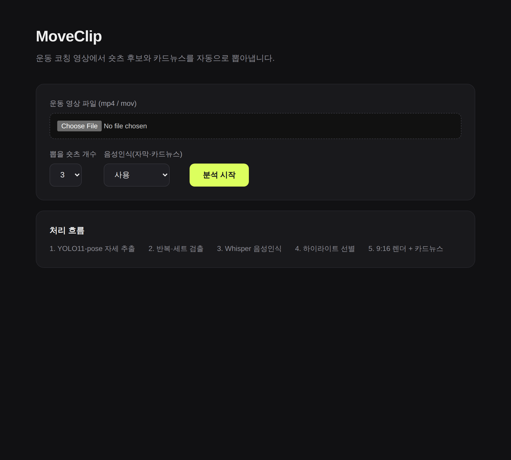 | 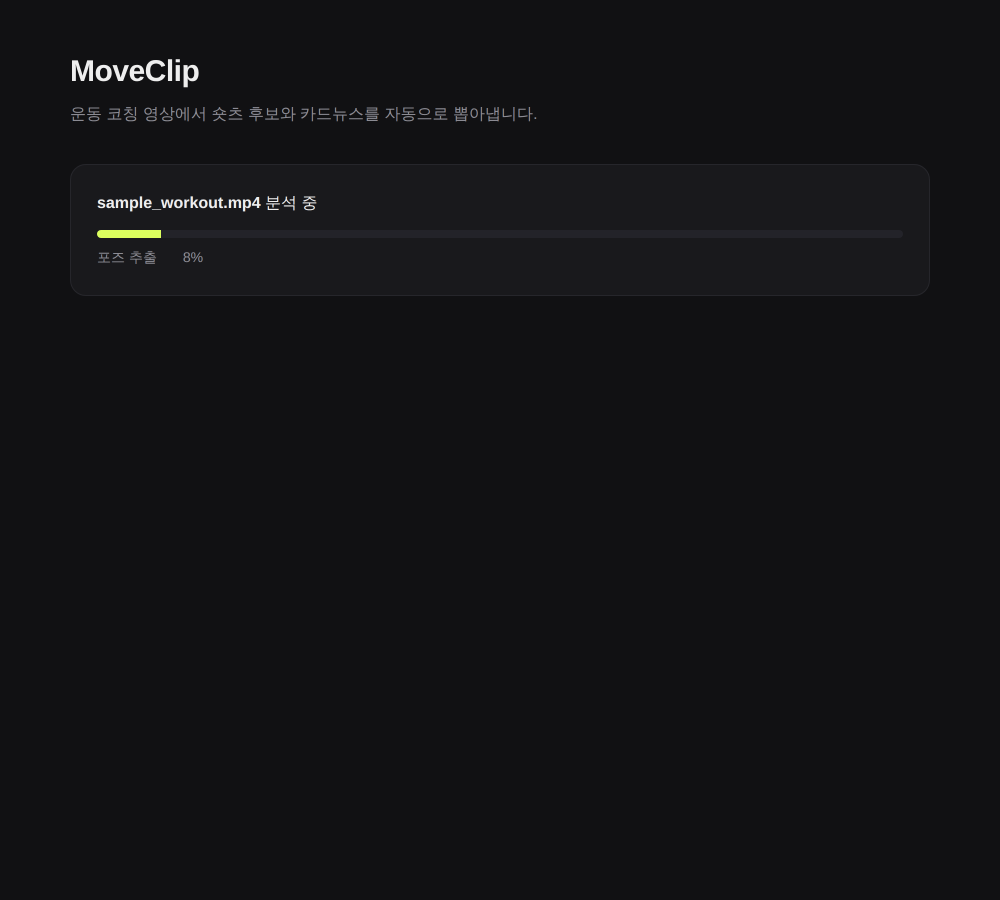 |  |

### 주요 옵션

| 옵션 | 설명 | 기본값 |
|---|---|---|
| `-k, --top-k` | 뽑을 숏츠 개수 | 3 |
| `--fps` | 분석 샘플링 fps. **5 미만으로 낮추지 마세요** (실패 사례 ③) | 5 |
| `--lang` | 음성인식 언어 | ko |
| `--stt-model` | `base`(200MB) / `small`(1.3GB, 한국어 권장) | small 있으면 small |
| `--no-stt` | 음성인식 생략 (빠름) | off |
| `--handle` | 카드뉴스에 들어갈 계정명 | @my_movement |

> **입력 영상 주의:** 자막이나 타이틀이 **박히기 전 raw 영상**을 넣으세요. 완성본을 넣으면 자막이 두 겹으로 겹치고, 9:16 크롭에서 원본 텍스트가 잘립니다. (실패 사례 ②)

---

## 실행 결과

### 실제 코칭 영상 (에어 스쿼트 플레이트 드릴)

**입력** 107초 / 1920×1080 / 한국어 음성 → **출력** 숏츠 3개 + 카드뉴스 9장 + 캡션 3건 + SRT 자막, **총 254초**

| 숏츠 #1 (5회) | 숏츠 #2 (2회) | 숏츠 #3 (2회) | 자동 생성 카드뉴스 |
|---|---|---|---|
| 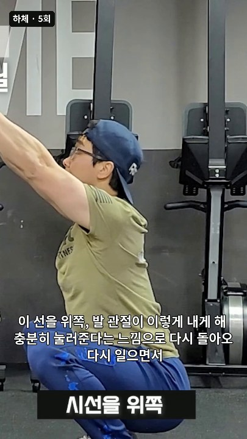 | 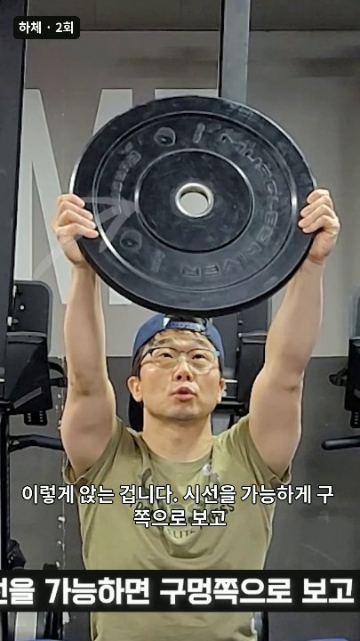 | 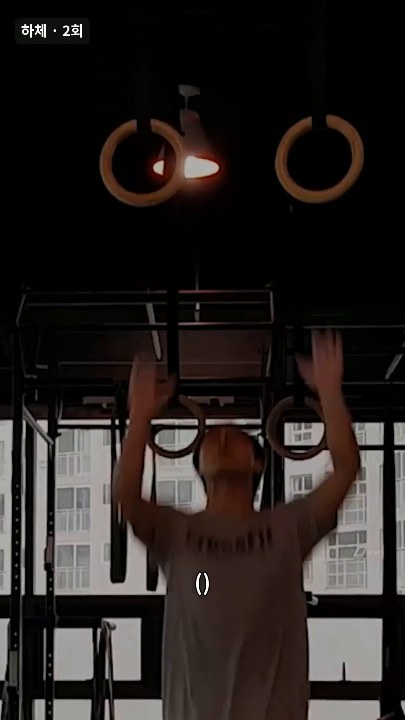 | 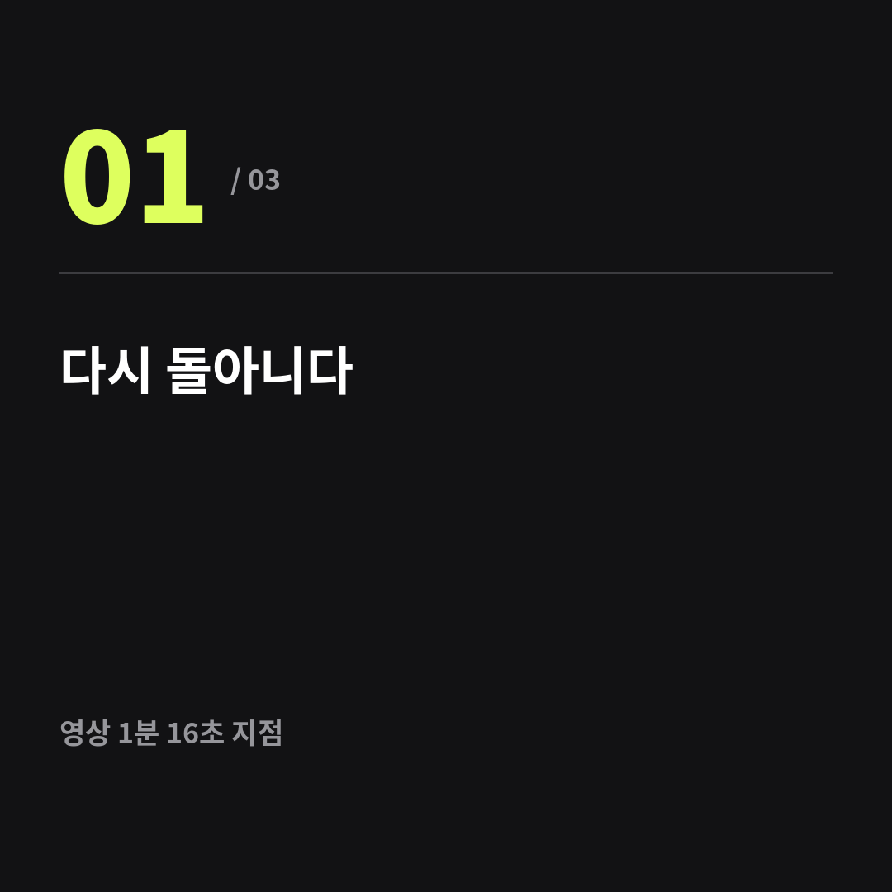 |

```
#1   53.8s ~  98.8s (45.0초)  하체 반복 동작(스쿼트·런지 계열)  반복 5회  — 반복 5회로 분량이 충분
#2   32.4s ~  52.4s (20.0초)  하체 반복 동작(스쿼트·런지 계열)  반복 2회  — 동작 리듬이 일정해 보기 좋음
#3    0.0s ~   9.8s ( 9.8초)  하체 반복 동작(스쿼트·런지 계열)  반복 2회  — 움직임이 커서 시선을 끎
```

영상 결과물: [`short_1.mp4`](docs/samples/real/short_1.mp4) · [`short_2.mp4`](docs/samples/real/short_2.mp4) · [`short_3.mp4`](docs/samples/real/short_3.mp4)
부가 산출물: [카드뉴스](docs/samples/real/cards_1) · [SRT 자막](docs/samples/real/transcript.srt) · [result.json](docs/samples/real/result.json)

> 결과 영상을 보면 **자막이 두 겹**입니다. 원본에 자막이 이미 박힌 완성본을 입력으로 썼기 때문입니다 — 실패 사례 ②로 기록해 뒀습니다. raw 영상을 쓰면 해결됩니다.

### 합성 테스트 영상 (재현 가능)

**입력** 59.6초 / 1280×720 → **출력** 숏츠 3개 + 카드뉴스 9장, **총 73초**

| 숏츠 #1 | 숏츠 #2 | 숏츠 #3 | 카드뉴스 |
|---|---|---|---|
| 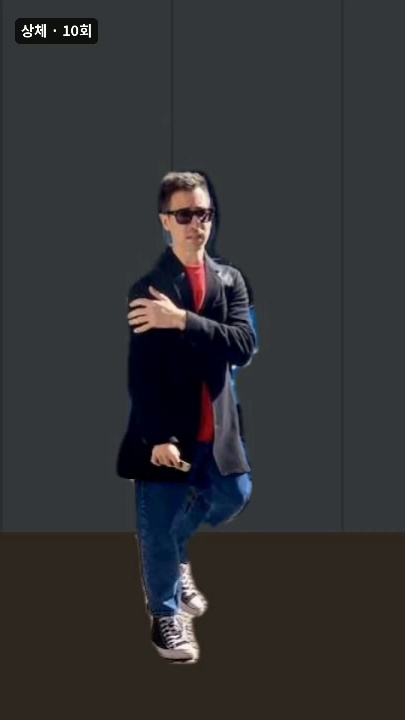 | 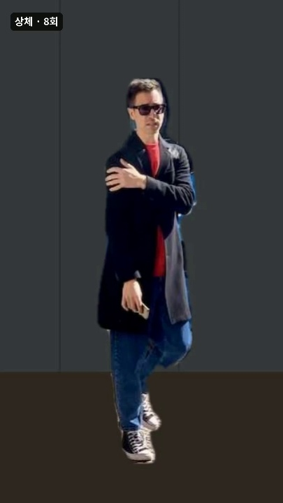 | 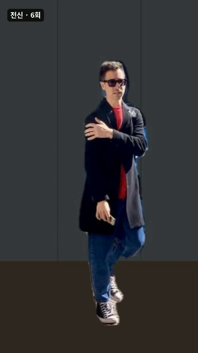 | 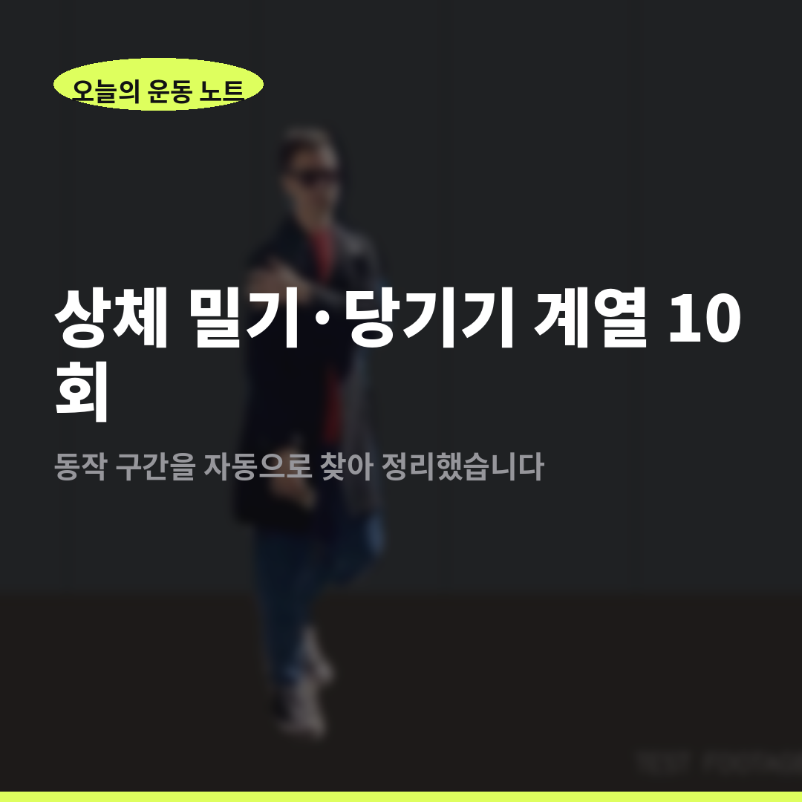 |

- 영상 샘플: [`docs/samples/short_1_demo.mp4`](docs/samples/short_1_demo.mp4)
- 원본 결과: [`docs/samples/result_sample.json`](docs/samples/result_sample.json)

---

## 검증 결과 요약

**두 가지로 검증했습니다** — ① 정답 라벨을 내가 정한 합성 영상, ② **실제 크로스핏 코칭 영상**(에어 스쿼트 드릴, 107초, 한국어 음성).
실제 영상은 원본 자막이 화면에 박혀 있어서, 그 자막을 음성인식 정답으로 쓸 수 있었습니다.

| 지표 | 목표 | 합성 영상 | **실제 영상** |
|---|---|---|---|
| 운동 구간 검출 | 재현율 0.8 | 1.00 (3/3) | **1.00** (3/3, 설명 구간 오검출 0) |
| 반복 수 정확도 | ±1회 80% | 100% 완전일치 | **본 드릴 5/5 정확** |
| 동작 종류 분류 | — | 0/3 ❌ | **3/3 정확** ✅ |
| 자막 문자 정확도 | 수정률 20% 이하 | 미검증 | **71% — 미달** ❌ |
| 처리 시간 | 3분 이내 | 73초 (59.6초 영상) | 254초 (107초 영상) △ |

### 실제 영상이 알려준 것

**버그 하나와 설계 결함 하나를 찾았습니다.** 1차 실행에서 *서서 설명하는 9초 구간을 스쿼트 3회로 오검출*했는데, 파고들어 보니 자기상관에서 주기를 잘못 뽑는 버그가 있었고(합성 영상에서는 반복이 규칙적이라 우연히 가려졌음), 더 근본적으로는 **코칭 영상에 자기상관 자체가 안 맞았습니다** — 설명하느라 반복 간격이 4.8~10.6초로 제멋대로거든요.

신호 선택 기준을 **가동범위 × 관절 우선순위**로 바꿨습니다. 코치는 말하면서 팔을 계속 쓰기 때문에 상체 신호는 오검출원이고, 무릎·고관절은 실제로 운동할 때만 움직입니다.

| | 개선 전 | 개선 후 |
|---|---|---|
| 설명 구간 오검출 | 3회 검출 ❌ | **검출 안 함** ✅ |
| 본 드릴 반복 수 | 5/5 ✅ | 5/5 ✅ |
| 동작 종류 분류 | 뒤섞임 ❌ | **전부 하체(스쿼트)** ✅ |

### 실패 사례

| # | 실패 | 결과 |
|---|---|---|
| ① | **한국어 STT** | 문자 정확도 base 61% → small 71%. 목표 미달. "크로스핏"→"크스", "플레이트"→"플이트" |
| ② | **이중 자막** | 자막이 박힌 완성본을 넣으면 생성 자막과 겹침 → raw 영상 필요 |
| ③ | 분석 fps 5→2 | 반복 정확도 **1.00 → 0.33** 붕괴 (샘플링 정리 위반) |
| ④ | 동작 분류 (합성) | 0/3 오분류 — **모델이 아니라 테스트 자산 문제였음** (실제 영상은 3/3 정확) |
| ⑤ | 준비 동작 오인 | 플레이트 집는 동작을 세트로 인식 |

> **한 줄 결론: "찾아주는 AI"는 실제 영상에서 작동했고, "받아쓰는 AI"는 아직 아닙니다.**
> 탐색 병목은 풀렸고, 다음 병목은 한국어 음성인식으로 옮겨갔습니다.

자세한 내용 → **[개선 효과 검증 결과](docs/03_validation.md)**

---

## 문서

| 문서 | 내용 |
|---|---|
| [문제 정의서](docs/01_problem.md) | 도메인, 현재의 문제, 개선 가설, 대상 사용자, 성공 기준 |
| [AI 모델 선정 근거](docs/02_model_selection.md) | 후보 비교와 선택 이유 (SAM·Diffusion·상용 STT를 쓰지 않은 이유 포함) |
| [개선 효과 검증 결과](docs/03_validation.md) | 정량 비교, 실패 사례 4건, 한계와 다음 스텝 |
| [채점 원본](docs/validation_result.md) | `tools/evaluate.py`가 자동 생성 (기본 실행) |
| [채점 원본 — 저fps 실패](docs/validation_result_fps2.md) · [2인 영상](docs/validation_result_2people.md) | 실패 사례 실험 결과 |

---

## 저장소 구조

```
moveclip/
├── main.py                  CLI 실행기
├── app.py                   데모 웹앱 (FastAPI)
├── setup_models.sh          모델 다운로드
├── pipeline/
│   ├── pose.py              (A) YOLO11-pose 자세 추출
│   ├── reps.py              (B) 반복·세트 검출  ← 핵심 로직
│   ├── stt.py               (E) Silero VAD + Whisper 음성인식
│   ├── highlight.py         (C) 하이라이트 점수화
│   ├── render.py            (D) 9:16 자동 크롭 + 자막 번인
│   ├── cards.py             (F) 카드뉴스·캡션 생성
│   └── run.py               파이프라인 오케스트레이터
├── tools/
│   ├── make_sample.py       정답 라벨 포함 테스트 영상 생성
│   ├── evaluate.py          정답 대비 채점
│   ├── check_stt.py         음성인식 단독 점검
│   └── shots.py             데모 스크린샷 촬영
└── docs/                    문제정의서·모델선정·검증결과·시연자료
```

`pipeline/` 각 모듈은 문제정의서 3-2의 A~F 단계와 1:1로 대응합니다.

---

## 재현 환경

Python 3.11 / CPU만 사용 (GPU 불필요) / Linux·macOS
실측: 1280×720 59.6초 영상 → 총 73초 (포즈 30.4s, 렌더 42.0s)

`ffmpeg`가 설치되어 있어야 합니다. (`brew install ffmpeg` / `apt install ffmpeg`)

---

## 라이선스·주의

- `data/`의 테스트 영상은 YOLO 기본 배포 이미지를 가공해 만든 **합성 자산**입니다. 실제 운동 영상이 아닙니다.
- `docs/samples/real/`의 결과물은 **본인 촬영본에서 생성한 것**입니다. 원본 영상(208MB)은 용량상 저장소에 넣지 않았습니다.
- 회원이 등장하는 영상을 다룰 때는 동의를 먼저 받으세요. 이 파이프라인은 전부 로컬에서 돌아가며 영상을 외부로 전송하지 않습니다.
